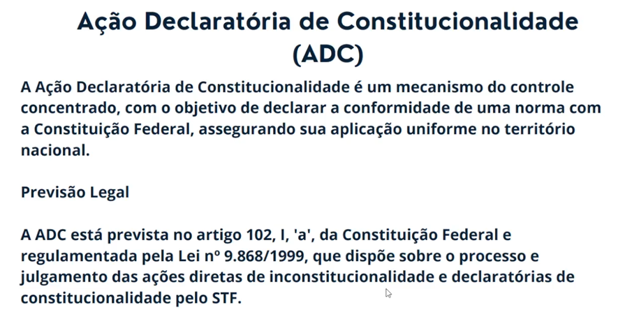
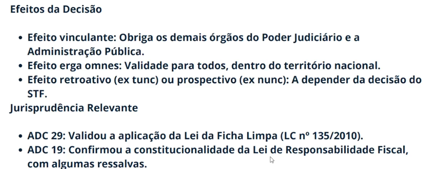

# Nacionalidade


OBS:
``` Existe uma ressalva com Portugal, para que eles tenham mesmo direito políticos, preciso que Portugal entregue os mesmos direito para o Brasileiro que mora em lá. (idenonidade moral e moradia ineterrupta) ```

OBS 2:
``` Na naturalização ordinária ganha pelo o tempo, no caso requisitado 15 anos vivendo no Brasil, ter residência e não ter condenação criminal. Serve para qualquer individuo estrangeiro, se isso levará perca da nacionalidade originaria, depende qual o critério para perda da nacionalidade originaria pelo estrangeiro que irá requerer aquela naturalização.  ```


OBS:
``` O Naturalizado Brasileiro pode virar Deputado Federal , Senador, pode ocupar mesa do senado e do congresso, mas nunca ser presidente do congresso ou do senado ou principalmente ocupar cargo de presidente ou vice-presidente mesmo vale para presidente da república, cargo de ministro do STF, carreira diplomática e oficiais das forças armadas.  ```


OBS:
``` Qualquer caso de fraude sobre naturalização, é motivo para perca. Também qualquer Brasileiro até nato pode requisitar fim da sua nacionalidade desde que não termina sendo Apátrida, de forma alguma não deve existe o resultado apátrida de nenhuma das formas mesmo nas fraudes, em regra geral possível perder nacionalidade com fraude ou de forma expressa por vontade própria, o única exceção deve ser expressa na prova se gerar Apátrida ai não pode.  ```

# Ação declaratória de Constitucionalidade (ADC) 

OBS:
``` É questão federal sobre a constituição de uma noma, o Estado pode discutir o assunto, mas sempre estará no âmbito federal o assunto. Toda lei criada a premissa que é constitucional. ```


OBS:
``` Serve para confirmar uma constitucionalidade de uma lei.  ```





<!--


OBS:
``` exemplo  ```

-->