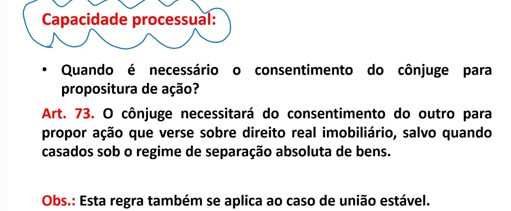
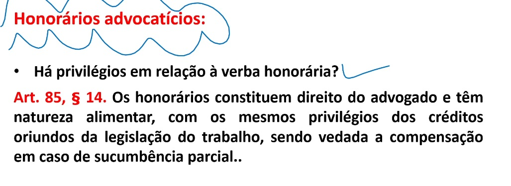
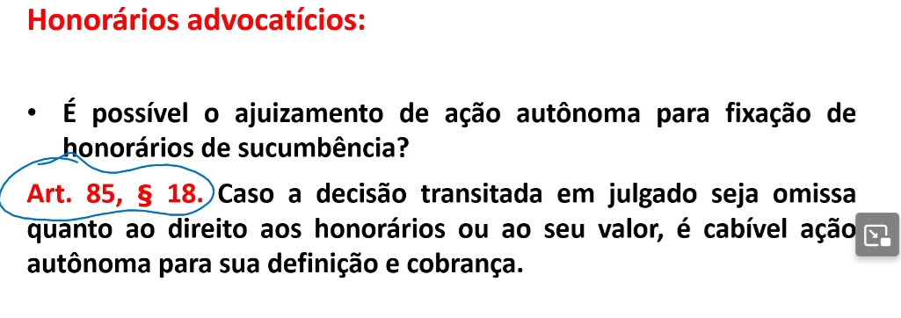
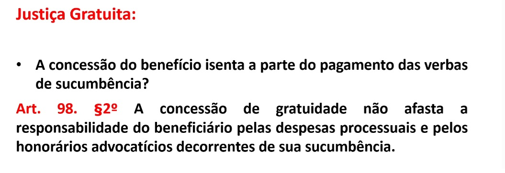
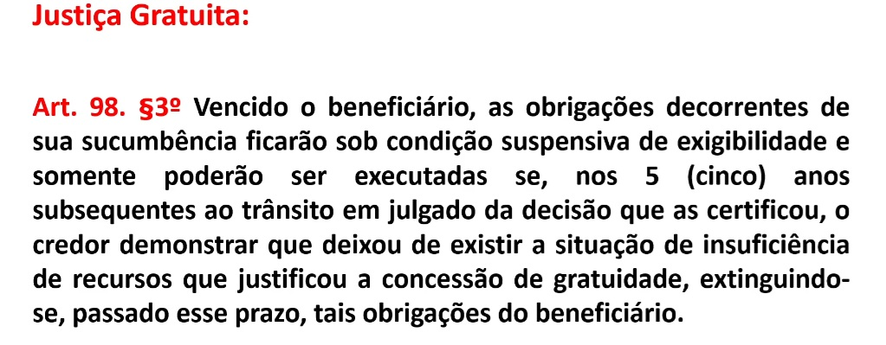

# Partes e Procuradores

OBS:
``` Essa mesma regra vale para união Estavel  ```


OBS:
``` Os honorários do advogado tem natureza alimentar e vedado compensação em sucumbência parcial .Quando o juiz esquece de colocar honorários, o advogado tem direito de embargar declaração ou recorrer para o tribunal e fixar os honorários, caso o advogado esqueça mesmo assim ele vai cair no próximo artigo postado abaixo.   ```


OBS:
```  Casos os embargos declaração não funciona possível entrar com ação autônoma para cobrança desses honorários esquecidos pelo juiz.   ```

## Justiça Gratuita

O fato da justiça gratuita não isenta dos custo honorários, o beneficiário da justiça gratuita pode ser cobrado caso dentre de 5 anos tenha capacidade de pagar os custos.    




OBS:
``` Não é porque o cliente está na justiça gratuita está isento a pagar a parte dos horários advocatícios, nem seu nem da outra parte, simplesmente diante 5 anos se a parte beneficiaria tiver condições terá que pagar, exemplo: digamos que a parte agora é pobre usufrui da justiça gratuita, depois de 3 anos ele ganha na mega da virada, está rico e agora tem as condições, perde benefícios, o mesmo não poderá ser cobrado após 5 anos. Ou seja divida caduca depois de 5 anos.     ```