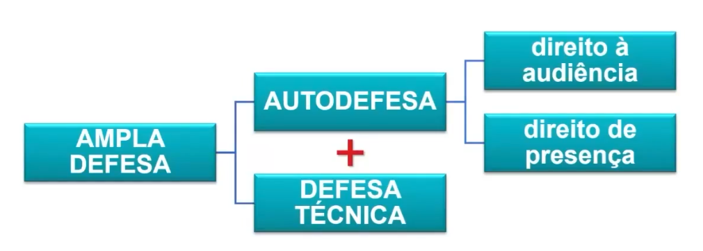
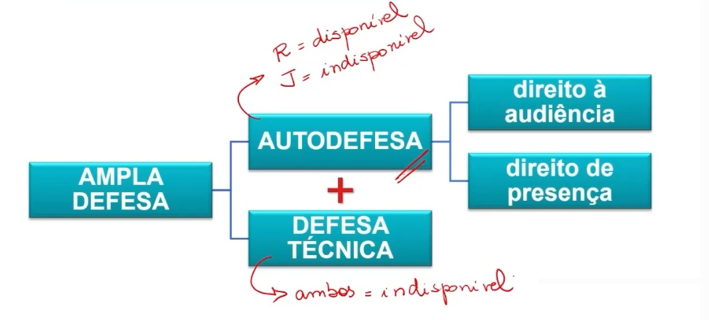
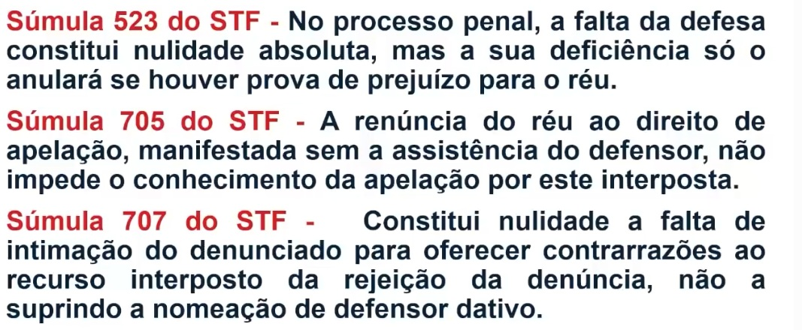
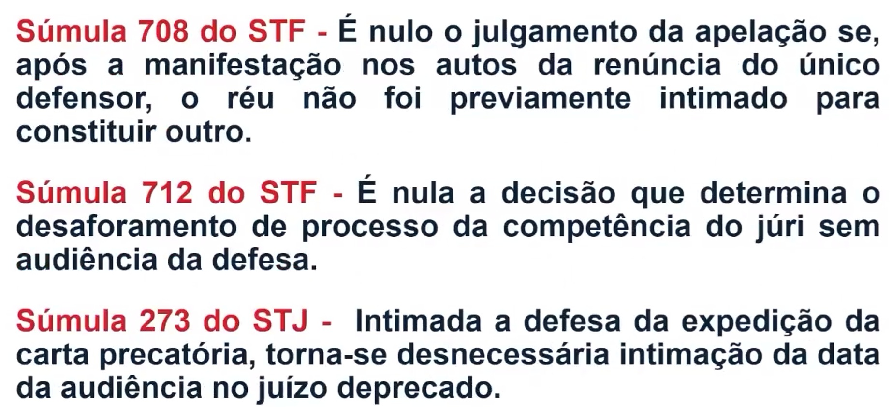

# 
 A Ampla Defesa 

Necessita da existência de um binômio, deve existir a autodefesa e a defesa técnica, ou seja, ambas partes tem direito ampla defesa e ao contraditório, no processo penal a ampla defesa não é aplicável quando se pensa no acusado, é um direito do acusado, réu tem direito a ampla defesa com o conceito com a concepção penal. 

Exemplo no processo civil o juiz pode indeferir os depoimentos se achar que o documento seja prova suficiente, porem no processo penal se o réu quiser do seu depoimento e suas versões dos fatos o juiz tem que ouvir, sobre probabilidade de nulidade caso recurse, o réu também tem direito ao silencio, pois não é obrigado a gerar provas contra si mesmo, "nemo tenetur se ipsum accusare.”. 
O direito está calado está no artigo 5 da Constituição, no pacto são José da Costa Rica.
Para o Réu a auto defesa sempre será disponível.

