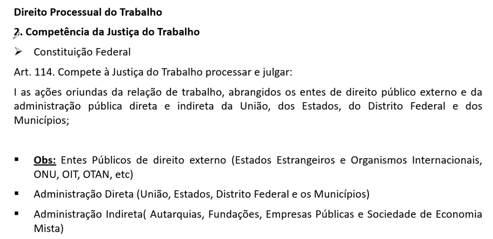

    OBS:
    ``` [Liberal x Cliente = Justiça Estadual] Quando caso sobre profissional liberal, não se envolver com a justiça do trabalho, pois quem fica para julgar esse tipo de caso é a justiça estadual. A justiça do trabalho ela será acionada sempre em casos de CLT e não liberais.  ```

 OBS:
    ``` Sim pode ajuizar porem o cumprimento de sentença deve ser feito por carta rogatoria, uma vez que é um processo internacional  [EMBAIXADA SE LEMBRAR CARTA]```

 OBS:
    ``` Quando se fala ONU , OMS etcs, [ORGANISMO INTERNACIONAL] , esses organizações internacionais, para ajuizar um processo trabalhista vai depender da norma internacional e da autorização do tratato.```
 
    OBS:
    ``` Servidor Efetivo , Estatutários - Concursato está fora da CLT [Meu pai Trabalhou no INSS, Concursado Estatutário não é CLT] ;  CELESTISTAS é Justiça do Trabalho ; Contratos temporário atender necessidade publica fora da Justiça do trabalho o Regime Juridico admnistrativo não é justiça do trabalho```

 
 
 OBS:
    ``` Ação possessória pela iniciativa privada é da justiça do trabalho  ```
     ``` Esbulho (Reintegração de posse) quando perde a posse ; turbação (Manutenção de posse) quando é parcial não perdeu a posso total, Interdito proibitório quando tem um probabilidade de Esbulho ou Turbação ela faz com que proíba a greve ```


 OBS:
    ```++  ```
    
     
<!--
    
    
    OBS:
    ``` exemplo  ```
    
-->